# Vo-keur 

Lars de Roos | Web Apps Project

# Week 2

## Day 1

In verband met Pinksteren is deze meeting verschoven naar een later tijdstip deze week.

## Day 2

Deze week werken we naar een Alpha versie van het project. Mijn doelen voor deze week zijn als volgt:

- Verenigingen structureren en volledig werkende html bouwen, waarin doorverwezen wordt naar een gegenereede html per vereniging
- Begin maken met de kieswijzer mocht er tijd over zijn deze week

Omdat ik hier maandag al wel aan was begonnen kon ik al enkele functionaliteiten laten zien, in overleg is later besloten om voor "Bootstrap Cards" te kiezen. Dit is besloten omdat dit een mooie weergave van de verenigingen zou zijn.

## Day 3

Vandaag hebben we uitgebreid een style guide opgesteld, omdat de genoemde programma's niet voor ons van toepassing zijn hebben we gebruik gemaakt van de volgende [link](https://www.python.org/dev/peps/pep-0008/).

Aan de hand hiervan zijn keuzes gemaakt die te vinden zijn in de stylesheet (STYLE.md).

## Day 4

De style guide is toegevoegd aan de map. 

Daarnaast is er gekozen om enkele aanpassingen te doen in de opmaak van de vereniging pagina. Het wordt zometeen hopelijk mogelijk om via de Google Maps API het adres weer te geven. Daarnaast wordt het mogelijk om via de website een mail te sturen naar de betreffende vereniging.

## Day 5

Vandaag was er weer een bijeenkomst waarin we uitgebreider, samen met de tutor, elkaars websites konden feedbacken. Na een korte meeting waarin onderstaande functies door mij werden gepresenteerd ben ik verder gegaan met het verzamelen van meer data. 
Er is nu een tweede vereniging toegevoegd. 

Er zijn nog wel problemen met het opbouwen van de models, vooral wanneer er doorverwezen moet worden naar andere pagina's. Hopelijk kan dat maandag opgelost worden... 

Komend weekend ga ik mij focussen op de kieswijzer en de API van Google Maps.

##### Scherm 1: Startscherm wanneer Leiden is gekozen
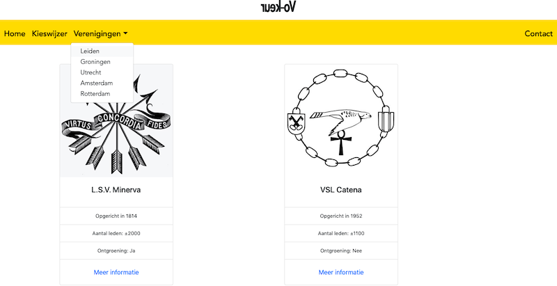

##### Scherm 2: Scherm waarin meer informatie over Minerva wordt opgevraagd
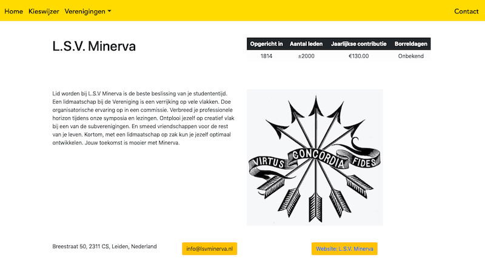

##### Scherm 3: De mogelijkheid om een mail te versturen naar de betreffende vereniging
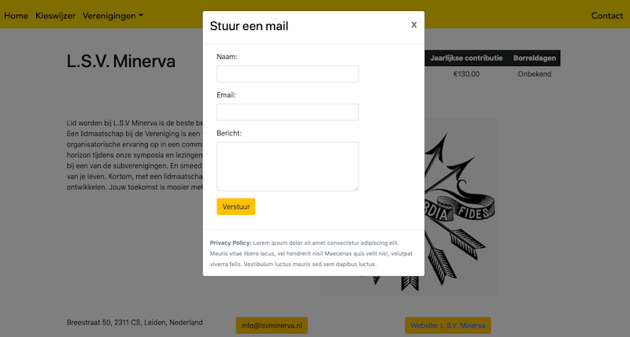

 
 
 
 

# Week 1

## Day 0

De dag waarop het idee is ontstaat dateert al uit september 2018. Het weekend voordat het project begon ben ik uitgebreid gaan uitzoeken of er al iets bestaat met betrekking tot het 'kiezen van een studentenvereniging'. Veel vragen kwam ik tegen 'Hoe kies je een vereniging?' 'Welke vereniging past bij mij?' en ik vond 1 website die een soortgelijk idee al had uitgewerkt. [Voorbeeld](http://www.lidwordeninamsterdam.nl).

Op deze website vond ik het volgende:
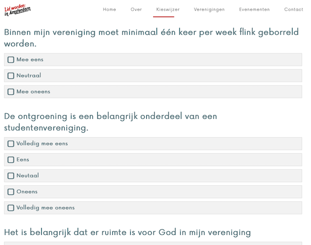
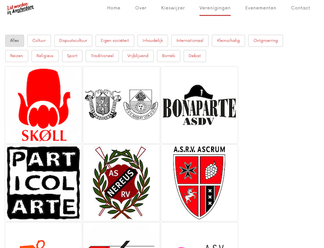

Het was natuurlijk jammer om te ontdekken dat er iets bestond, maar de uitwerking van deze website is niet erg netjes. Ook viel de styling erg tegen én het belangrijkste: ze doen het enkel voor Amsterdam. Ik zou het graag breder willen trekken over meerdere steden. 
Met dit idee ging ik maandag naar Science Park, ervan overtuigd dat dit een prima idee kon zijn...

## Day 1

Na een korte duidelijke inleiding konden we beginnen met het uitwerken van ons idee. Een eerste opzet moest worden uitgetekend. Al snel kwam ik tot de volgende opzet:

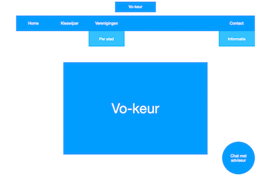
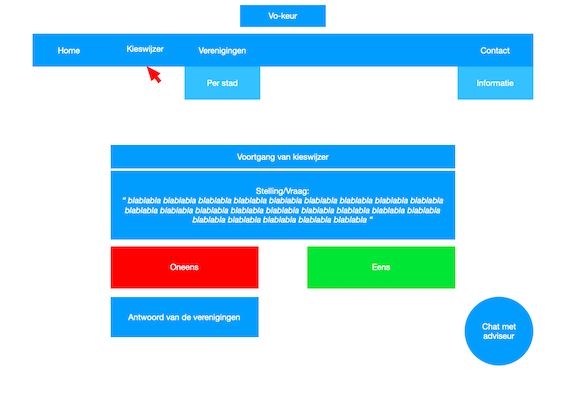
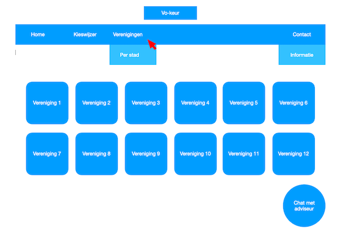
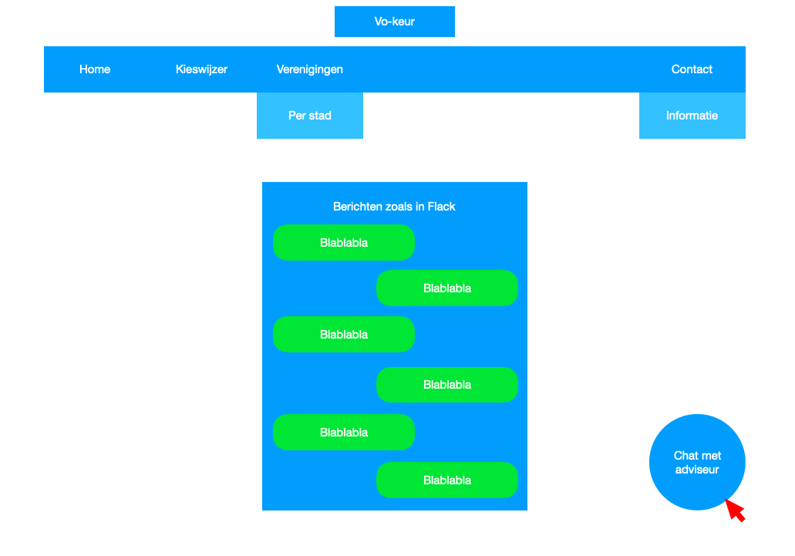

Uiteraard gebaseerd op eerdere ervanringen met webdesign en gedeeltelijk op het [voorbeeld](http://www.lidwordeninamsterdam.nl). 

Het is bij mij echter wel de bedoeling dat de kieswijzer er als volgt uit komt te zien:

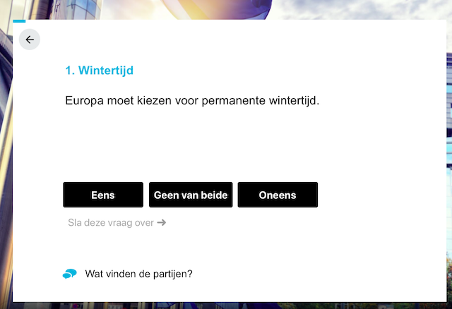
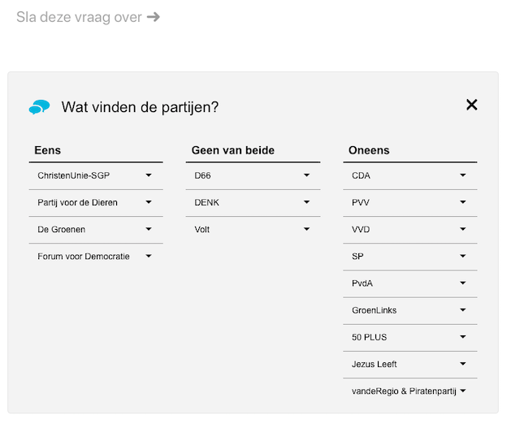

Dit lijkt veel professioneler en is, denk ik, niet eens zo heel lastig vorm te geven.

## Day 2

Met het team besprak ik mijn opdracht. Leuk idee vonden ze allen, ook de tutor staat achter het idee en was ook al snel erg betrokken. Het publiek wat ik met de website wil bereiken zijn hoofdzakelijk (toekomstige) studenten. Ook voor anderen kan het relavant zijn, bijvoorbeeld om een overzicht te krijgen van alle verenigingen die er te vinden zijn in een bepaalde stad. We kwamen tot de conclusie dat het een soort gat opvult, wat natuurlijk erg leuk is aangezien daardoor daadwerkelijk een bijdrage geleverd kan worden. 

Op deze dag heb ik ook de opzet gemaakt wat betreft de inrichting van de website:
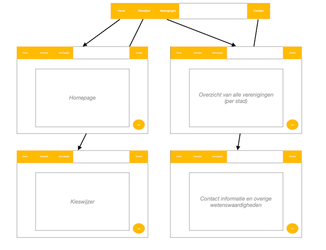
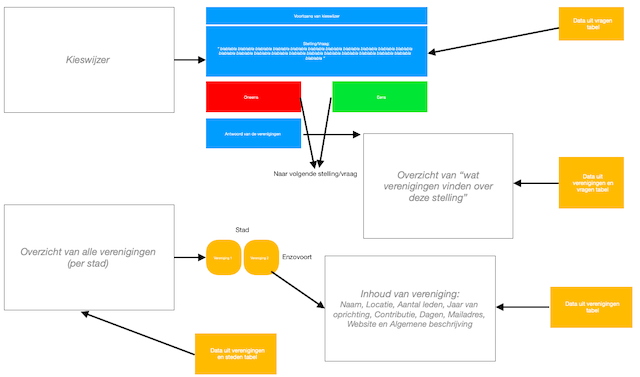

Hiervoor heb ik gekozen om een uitgebreide dataset te gebruiken die ik grotendeels zelf zal moeten opstellen. 
Om alle links tussen de data weer te geven is het volgende schema gemaakt:
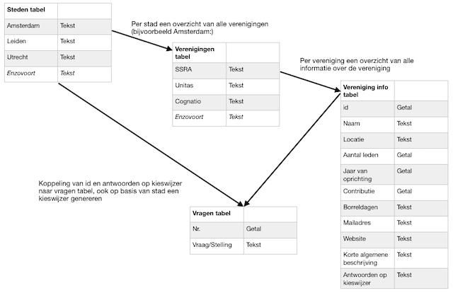

Het bleek, tot op het heden, niet nodig om API's of andere databronnen te gerbuiken. Met als simpele reden dat deze niet bestaan voor mijn casus. 

## Day 3

Deze dag bespraken we het technische design wat we de dag eerder hadden ingeleverd, omdat wij het hier tijdens het maken al uitgebreid over hadden gehad waren er niet veel toevoegingen nodig. Ik kon ook goed anderen helpen met het aanvullen van hun ideeen en het gebruik van API's. 

Ook heb ik op deze dag een begin gemaakt met het vormgeven van mijn website. Omdat ik erg houd van het design gedeelte van de website heb ik hier eerst tijd aan besteed. Zo heb ik een titel die kan spinnnen gevonden en is de navigatiebar volledig afgestemd op mijn behoeftes: 
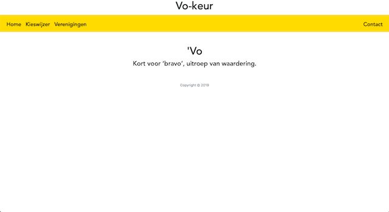

## Day 4

De dingen die ik komende tijd heb uitgezocht en nog moet uitzoeken hebben vooral veel te maken met het opbouwen en presenteren van de data. Ik heb al zo veel mogelijk gelezen met betrekking tot het maken van kieswijzers en heb afgekeken van de grote bestaande websites die dergelijke kieswijzers aanbieden. Het lijstje:
- Kieswijzer (hoe opbouwen)
- Kieswijzer (hoe presenteren in html, met overgangen)
- Kieswijzer (hoe antwoorden opslaan)
- Kieswijzer (hoe conclusie trekken o.b.v. antwoorden)
- Kieswijzer (hoe zorgen dat verenigingen hun mening geven op stellingen)
- Verenigingen (hoe weergeven in html)
- Overige leuke effecten en dergelijke in css, voor later in dit project

## Day 5

Afgelopen vrijdag hebben we een uitgebreide meeting gehad waarin we, met onze tutor, elkaar de protoypes hebben laten zien. Mijn website bevatte het nodige, men kon navigeren. Het doel voor komende week hebben we opgesteld: de models opbouwen en data presenteren bij de Verenigingen pagina. Daarnaast wil ik zelf ook zo snel mogelijk starten met het opbouwen van de kieswijzer. 
De anderen heb ik kunnen helpen met feedback op hun websites. 

