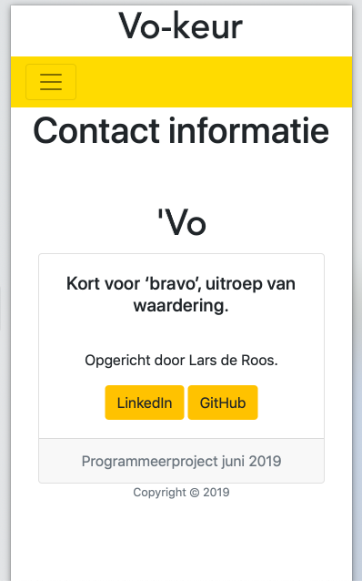

# Vo-keur 

Lars de Roos | Web Apps Project

# Week 4

## Day 1
Op de eerste dag van deze laatste week moest ik nog zorgen dat de vergelijking daadwerkelijk een uitkomst zou geven. Na een korte tijd doorprogrammeren bleek het al te werken (!!!). Alle to do's die ik vorige week had opgesteld waren daardoor behaald. 
De nieuwe to do's voor deze week, naast het eindrapport en de video zijn:
- Verenigingen toevoegen
- Alles mooier maken (look/feel van de website)
- Code opschonen

Sommige van deze punten heb ik dezelfde dag nog kunnen doen. Zo kwam ik er ook achter dat enkele optionele doelen van vorige week niet meer nodig/haalbaar waren. Om die reden is er nu 'altijd' een biermuis, is de emailstyling aangespast naar een simpele 'naam en bericht' en zijn er geen grote lappen tekst getypt ter ondersteuning van het geheel (de website spreekt voor zich..). 

Enkele punten om te overdenken:
- Stad uniek maken in admin zodat de combinatie van Groningen + Minerva automatisch niet mogelijk is.
- Order_by query aanmaken zodat mensen een eigen overzicht kunnen genereren in verenigingen.html (niet noodzakelijk, wel leuk).

! Screenshots van deze week zijn te vinden in de huidige README. !

## Day 2
Vandaag heb ik ruim 20 verenigingen toegevoegd, dit heeft bij elkaar bijna 6 uur gekost. Dit maakte het direct duidelijk dat het onverstandig zou zijn om deze manier van data vergaren te houden wanneer er meer interesse zou zijn in het uitbouwen van deze website. Ook bleek dat enkele verenigingen dermate weinig informatie beschikbaar hadden dat werd afgezien van het toevoegen van de vereniging in kwestie. In twee gevallen was het niet direct mogelijk om de contributie in te zien, om deze reden is het 'standaard bedrag' van €100,- geintroduceerd. 

Nog een kleine bug is ontdekt:
- Volgorde presenteren van 'beste match'? Welke van de twee stukken code gebruiken?

De code is volledig opgeschoont, er zijn meerdere readme-achtige bestanden gemaakt (inclusief nieuwe afbeeldingen e.d.) en nu dit PROCESS.md ook is bijgewerkt hoef ik voor deze week enkel nog te zorgen dat ik de code, de video en het verslag op tijd inlever. 

! Screenshots van deze week zijn te vinden in de huidige README. !

## Day 3

 
 

# Week 3

## Day 1

Vandaag de verenigingen pagina's afgemaakt. Google API toegevoegd en Kieswijzer uitgedacht. Dat wordt nog niet heel makkelijk helaas. 

To do's voor komende week:

- Kieswijzer (vragen opeenvolgend, soort quiz).
- Kieswijzer (data opslaan en vergelijking met partijen uitvoeren -> tot 'beste' partij komen.
- Google API (data inladen per vereniging, misschien via GeoCoding anders zelf set opbouwen).
- Woordenlijst navigeerbaar maken a.d.h.v. letters (modal is al gereed)

Optioneel:

- Email naar vereniging stylen (html/css)
- Slider voor JavaScript met Bierdouche
- Over/Algemeen (uitleg) teksten typen

## Day 2

Na al snel ondervonden te hebben dat het maken van een dergelijke quiz niet heel gemakkelijk is heb ik ervoor gekozen om eerst alle andere functionaliteiten af te maken. Om die reden zijn nu de homepage, woordenboek en contact pagina's gemaakt en afgerond. Voor de woordenboek pagina zijn nieuwe modals gebouwd en is een grote hoeveelheid data (handmatig) toegevoegd.

De homepage

De woordenboek pagina

De contact pagina

## Day 3

Op deze dag heb ik zoveel mogelijk geprobeerd om kleine bugs te verwijderen en alles netjes te maken. Zo is er uitgebreid gecontroleerd hoe het kwam dat modals achter de andere inhoud werden weergegeven, dit is sterk afhankelijk van de soort browser, Safari kan het niet aan zo blijkt... 
Daarnaast is de gehele opmaak van alle onderdelen van de website afgerond, teksten zijn netjes gecentreerd en de weergave voor een iPhone is geoptimaliseerd, (zie afbeeldingen onderaan deze dagbeschrijving).

Ook is er een kieswijzer toegevoegd, zie de afbeelding. Hiermee is dit punt: `Kieswijzer (vragen opeenvolgend, soort quiz).` Voltooid!

Afbeelding Kieswijzer

`Google API (data inladen per vereniging, misschien via GeoCoding anders zelf set opbouwen).` Ook dit is geslaagd, wel kan er in een later stadium alsnog gekozen worden voor GeoCoding (van Adres naar coordinaten via Google Maps ipv handmatig) aangezien het uitzoeken van lat/lng coordinaten veel onnodige tijd kost wanneer je een vereniging moet toevoegen als Admin. 

Afbeelding Google Maps API van twee verenigingen

Daarnaast is het besluit genomen om de email niet verder te stylen, in verband met het leren van PHP (waar ik geen tijd voor heb). Ook de slider voor JavaScript is na een lange tijd testen nietig verklaard (het is onmogelijk om een javascript bestand te verwijderen nadat het is aangemaakt zonder alle styling te verliezen)
De woordenlijst navigeerbaar maken a.d.h.v. letters is een optinoneel doel geworden. 

Afbeeldingen met betrekking tot iPhone optimalisatie:

## Day 4

Op deze dag ben ik verder gegaan met het uitzoeken hoe dit doel `Kieswijzer (data opslaan en vergelijking met partijen uitvoeren -> tot 'beste' partij komen.` gerealiseerd kan worden. Hier was ik gisteravond al mee begonnen, echter mislukte dit volledig. 
Het volgende leek mij het beste plan: Een array aanmaken met LocalStorage, deze vullen met de gegevens die uit de knoppen komen (eens oneens gvb) en dan met JSON een lijstje kunnen printen die, vervolgens, vergeleken kan worden met een JSON uitdraai van de database (de modal verant is hiervoor aangemaakt). 
Dit is vandaag wedereom mislukt. Daarnaast heb ik tijd besteed om dit proces weer bij te werken en meerdere afbeeldingen toe te voegen. Hopelijk lukt het morgen om de laatste functionaliteit (de kieswijzer data opslag) werkend te krijgen met behulp van de begeleiding. 

Het bespreken van het uitsluiten van bepaalde functies was al gedaan, vandaar dat dit al deels beschreven is bij Dag 3 van deze Week. Een kort overzichtje van de functies die worden geschrapt (uit de to-do lijst van deze week):

- Woordenlijst navigeerbaar maken a.d.h.v. letters (modal is al gereed)
- Email naar vereniging stylen (html/css)
- Slider voor JavaScript met Bierdouche

De teksten typen en nog wat verenigingen toevoegen wil ik komende week nog doen. Dit is echter van minder groot belang dan de data opslag van de kieswijzer. 

## Day 5

Vandaag heb ik mij volledig kunnen richten op het afmaken van de kieswijzer. Data kan worden opgeslagen via een Ajax request (JSON) en ook de data uit de database wordt doorgestuurd via JSON naar de website. 
Het laatste onderdeel is nu de vergelijking, hiermee heb ik een begin kunnen maken. Maar ik heb het idee dat er een vergelijking tussen appels en de formules van Newton gedaan wordt, waardoor er geen uitkomst mogelijk is. Ik hoop dat ik hier maandag nog mee geholpen kan worden. Het scherm wat volgt op de kieswijzer is alvast gemaakt, zodat er geen functionliteiten ontbreken/toegevoegd moeten worden volgende week. 

Afbeeldingen van de stappen die de kieswijzer nu bevat (begin, eind en resultaat):

Tijdens de weekelijkse meeting met de tutor hebben we allen onze beta-versies kunnen laten zien en uitgebreid beoordeeld op verschillende punten. Ik kon vooral feedback geven op de interface/interactie (bijvoorbeeld: hier ontbreken knoppen, hier moet extra uitleg). Ook heb ik bij beide teamgenoten de website getest op bugs die ervoor zouden kunnen zorgen dat de website crashte. Dit lukte (helaas voor hun) nog té goed. Ze hadden wel veel aan deze tests. We hebben afgesproken dit volgende week nog uitgebreider te doen. 
Over mijn website was niet veel te zeggen, het ziet er volledig en professioneel uit. Als de laatste functie echt werkt (de kieswijzer) dan is hij helemaal af!

 
 

# Week 2

## Day 1

In verband met Pinksteren is deze meeting verschoven naar een later tijdstip deze week.

## Day 2

Deze week werken we naar een Alpha versie van het project. Mijn doelen voor deze week zijn als volgt:

- Verenigingen structureren en volledig werkende html bouwen, waarin doorverwezen wordt naar een gegenereede html per vereniging
- Begin maken met de kieswijzer mocht er tijd over zijn deze week

Omdat ik hier maandag al wel aan was begonnen kon ik al enkele functionaliteiten laten zien, in overleg is later besloten om voor "Bootstrap Cards" te kiezen. Dit is besloten omdat dit een mooie weergave van de verenigingen zou zijn.

## Day 3

Vandaag hebben we uitgebreid een style guide opgesteld, omdat de genoemde programma's niet voor ons van toepassing zijn hebben we gebruik gemaakt van de volgende [link](https://www.python.org/dev/peps/pep-0008/).

Aan de hand hiervan zijn keuzes gemaakt die te vinden zijn in de stylesheet (STYLE.md).

## Day 4

De style guide is toegevoegd aan de map. 

Daarnaast is er gekozen om enkele aanpassingen te doen in de opmaak van de vereniging pagina. Het wordt zometeen hopelijk mogelijk om via de Google Maps API het adres weer te geven. Daarnaast wordt het mogelijk om via de website een mail te sturen naar de betreffende vereniging.

## Day 5

Vandaag was er weer een bijeenkomst waarin we uitgebreider, samen met de tutor, elkaars websites konden feedbacken. Na een korte meeting waarin onderstaande functies door mij werden gepresenteerd ben ik verder gegaan met het verzamelen van meer data. 
Er is nu een tweede vereniging toegevoegd. 

Er zijn nog wel problemen met het opbouwen van de models, vooral wanneer er doorverwezen moet worden naar andere pagina's. Hopelijk kan dat maandag opgelost worden... 

Komend weekend ga ik mij focussen op de kieswijzer en de API van Google Maps.

##### Scherm 1: Startscherm wanneer Leiden is gekozen

##### Scherm 2: Scherm waarin meer informatie over Minerva wordt opgevraagd

##### Scherm 3: De mogelijkheid om een mail te versturen naar de betreffende vereniging

 
 

# Week 1

## Day 0

De dag waarop het idee is ontstaat dateert al uit september 2018. Het weekend voordat het project begon ben ik uitgebreid gaan uitzoeken of er al iets bestaat met betrekking tot het 'kiezen van een studentenvereniging'. Veel vragen kwam ik tegen 'Hoe kies je een vereniging?' 'Welke vereniging past bij mij?' en ik vond 1 website die een soortgelijk idee al had uitgewerkt. [Voorbeeld](http://www.lidwordeninamsterdam.nl).

Op deze website vond ik het volgende:

Het was natuurlijk jammer om te ontdekken dat er iets bestond, maar de uitwerking van deze website is niet erg netjes. Ook viel de styling erg tegen én het belangrijkste: ze doen het enkel voor Amsterdam. Ik zou het graag breder willen trekken over meerdere steden. 
Met dit idee ging ik maandag naar Science Park, ervan overtuigd dat dit een prima idee kon zijn...

## Day 1

Na een korte duidelijke inleiding konden we beginnen met het uitwerken van ons idee. Een eerste opzet moest worden uitgetekend. Al snel kwam ik tot de volgende opzet:

Uiteraard gebaseerd op eerdere ervanringen met webdesign en gedeeltelijk op het [voorbeeld](http://www.lidwordeninamsterdam.nl). 

Het is bij mij echter wel de bedoeling dat de kieswijzer er als volgt uit komt te zien:

Dit lijkt veel professioneler en is, denk ik, niet eens zo heel lastig vorm te geven.

## Day 2

Met het team besprak ik mijn opdracht. Leuk idee vonden ze allen, ook de tutor staat achter het idee en was ook al snel erg betrokken. Het publiek wat ik met de website wil bereiken zijn hoofdzakelijk (toekomstige) studenten. Ook voor anderen kan het relavant zijn, bijvoorbeeld om een overzicht te krijgen van alle verenigingen die er te vinden zijn in een bepaalde stad. We kwamen tot de conclusie dat het een soort gat opvult, wat natuurlijk erg leuk is aangezien daardoor daadwerkelijk een bijdrage geleverd kan worden. 

Op deze dag heb ik ook de opzet gemaakt wat betreft de inrichting van de website:

Hiervoor heb ik gekozen om een uitgebreide dataset te gebruiken die ik grotendeels zelf zal moeten opstellen. 
Om alle links tussen de data weer te geven is het volgende schema gemaakt:

Het bleek, tot op het heden, niet nodig om API's of andere databronnen te gerbuiken. Met als simpele reden dat deze niet bestaan voor mijn casus. 

## Day 3

Deze dag bespraken we het technische design wat we de dag eerder hadden ingeleverd, omdat wij het hier tijdens het maken al uitgebreid over hadden gehad waren er niet veel toevoegingen nodig. Ik kon ook goed anderen helpen met het aanvullen van hun ideeen en het gebruik van API's. 

Ook heb ik op deze dag een begin gemaakt met het vormgeven van mijn website. Omdat ik erg houd van het design gedeelte van de website heb ik hier eerst tijd aan besteed. Zo heb ik een titel die kan spinnnen gevonden en is de navigatiebar volledig afgestemd op mijn behoeftes: 

## Day 4

De dingen die ik komende tijd heb uitgezocht en nog moet uitzoeken hebben vooral veel te maken met het opbouwen en presenteren van de data. Ik heb al zo veel mogelijk gelezen met betrekking tot het maken van kieswijzers en heb afgekeken van de grote bestaande websites die dergelijke kieswijzers aanbieden. Het lijstje:
- Kieswijzer (hoe opbouwen)
- Kieswijzer (hoe presenteren in html, met overgangen)
- Kieswijzer (hoe antwoorden opslaan)
- Kieswijzer (hoe conclusie trekken o.b.v. antwoorden)
- Kieswijzer (hoe zorgen dat verenigingen hun mening geven op stellingen)
- Verenigingen (hoe weergeven in html)
- Overige leuke effecten en dergelijke in css, voor later in dit project

## Day 5

Afgelopen vrijdag hebben we een uitgebreide meeting gehad waarin we, met onze tutor, elkaar de protoypes hebben laten zien. Mijn website bevatte het nodige, men kon navigeren. Het doel voor komende week hebben we opgesteld: de models opbouwen en data presenteren bij de Verenigingen pagina. Daarnaast wil ik zelf ook zo snel mogelijk starten met het opbouwen van de kieswijzer. 
De anderen heb ik kunnen helpen met feedback op hun websites. 

