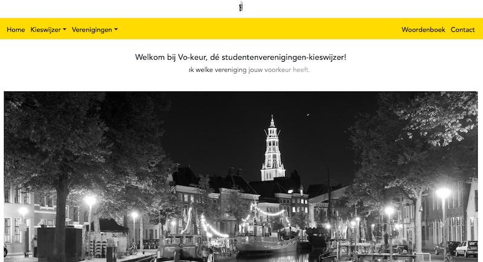
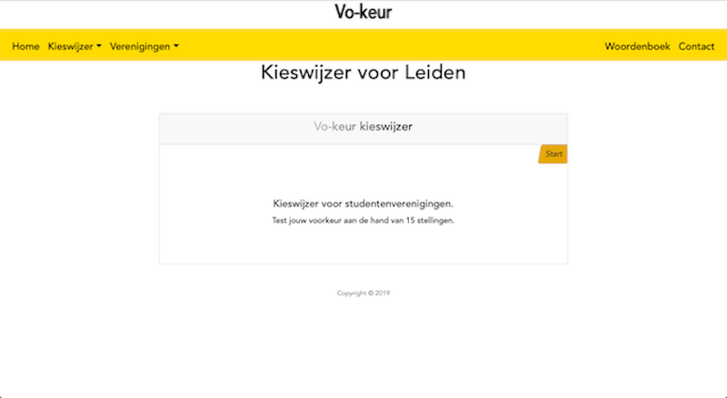
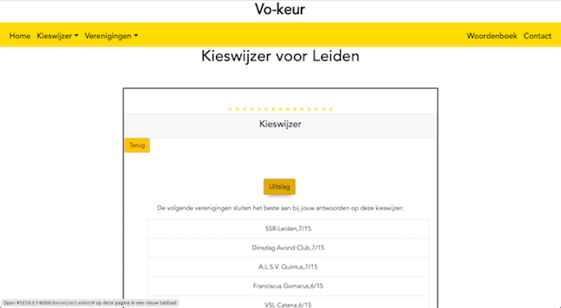
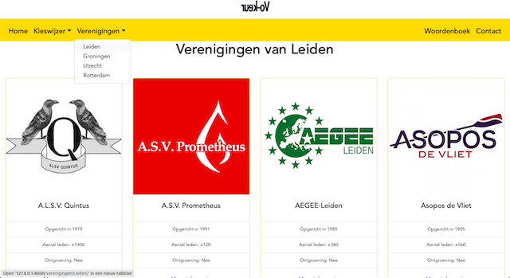
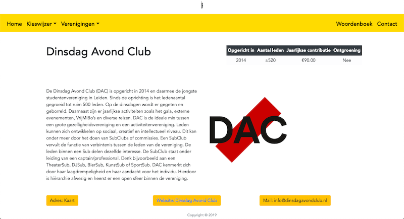
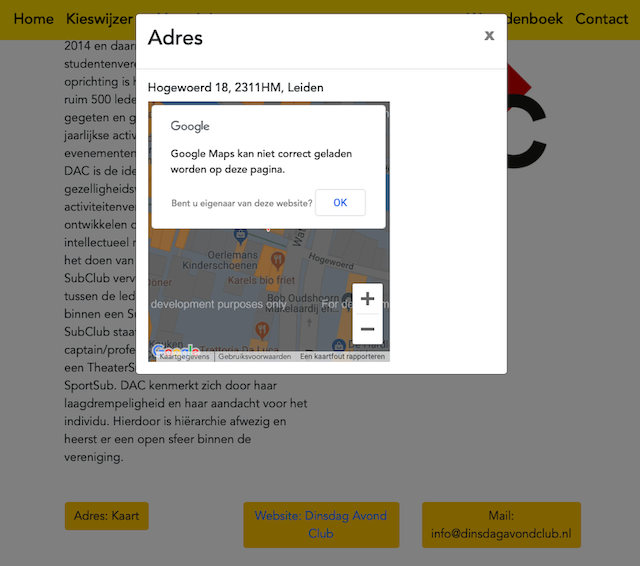
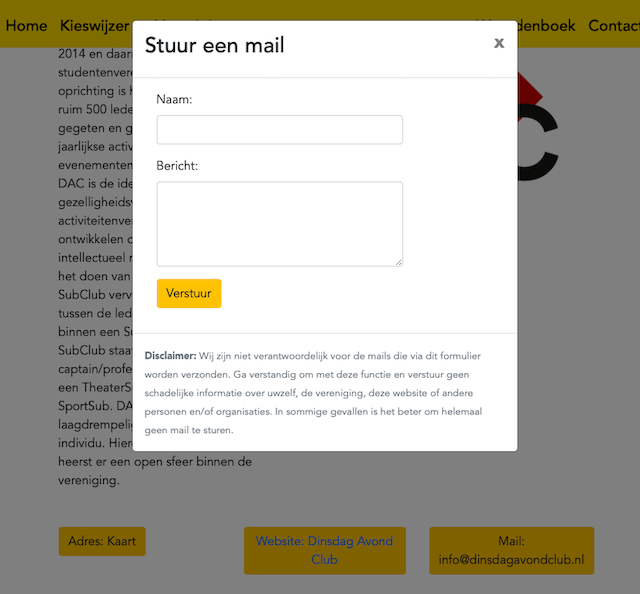
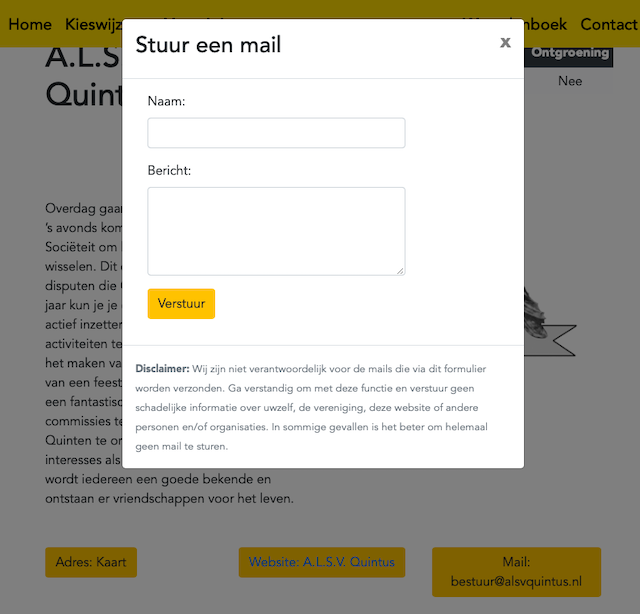
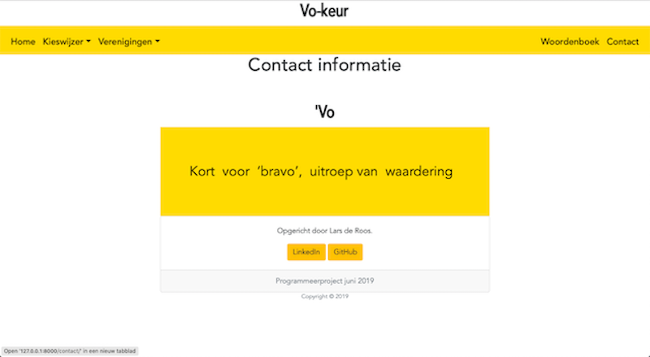

# Vo-keur 

Lars de Roos | Web Apps Project

#### Purpose
The number of students who join student associations has been falling for a long time. This is due to poor publicity and the costs of membership. Yet on the internet the question is often asked "Which student association suits me?". This web application has been designed to respond to this. It serves as a guide for student associations, to find the perfect match as a student!

#### Screenshots
##### Homepage

##### Kieswijzer begin

##### Kieswijzer vragen

##### Kieswijzer uitslag

##### Verenigingen Leiden

##### Vereniging uit Leiden

##### Vereniging uit Leiden (Maps)

##### Vereniging uit Leiden (Mail)

##### Verenigingen Utrecht

##### Woordenboek

##### Contact informatie

#### Copyright Statement

##### Own copyright statement 

##### Sources of external code, images and other materials 

Hover.css is made available under a MIT license. Copyright (c) 2017 - Ian Lunn.
`Vokeur/website/static/website/hover-min.css`

90's Cursor Effects is made available under a MIT license. Copyright (c) 2016 - Tim Holman.
`Vokeur/website/static/website/mouse.js`

The text effect "flash", which can be found in `Vokeur/website/static/website/styles.scss`, is from [this link](https://codepen.io/FrankieDoodie/pen/dgVGad).

The text effect "spinner", which can be found in `Vokeur/website/static/website/styles.scss`, is from [this link](https://canary---yellow.com). 

All images in `Vokeur/website/media` are from the facebook pages or websites of the used associations.
